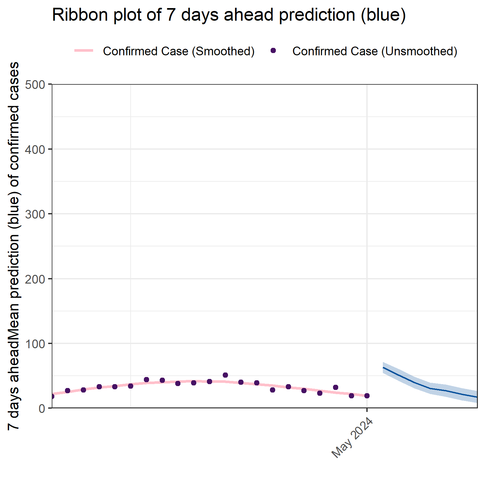

<!-- README.md is generated from README.Rmd. Please edit that file -->

# ViroReportR 

<!-- badges: start -->

[](https://lifecycle.r-lib.org/articles/stages.html#experimental)
[](https://CRAN.R-project.org/package=ViroReportR)
[](https://github.com/BCCDC-PHSA/ViroReportR/actions/workflows/R-CMD-check.yaml)
<!-- badges: end -->

The goal of `ViroReportR` is to provide a toolbox to conveniently
generate short-term forecasts (with accompanied diagnostics) for viral
respiratory diseases.

## Installation

`ViroReportR` depends on the latest version of the `EpiEstim` package
(2.4). Thus, this version of the package must be installed from GitHub
prior to installing the `ViroReportR` package using:

``` r
# install.packages("devtools")
install.packages('EpiEstim', repos = c('https://mrc-ide.r-universe.dev', 'https://cloud.r-project.org'))
```

You can then install the development version of `ViroReportR` from
[GitHub](https://github.com/) with:

``` r

devtools::install_github("BCCDC-PHSA/ViroReportR")
```

## Quick Start

`ViroReportR` can be used to generate short-term forecasts with
accompanied diagnostics in a few lines of code. We go through an example
here where the `EpiEstim` backend is used to generate forecasts of
Influenza-A.

``` r
library(ViroReportR)
#> ================================================
#> Welcome to ViroReportR! 
#> Please run `pkgdown::build_site(lazy = TRUE)` in your console 
#> to access documentation on the package website 
#> ================================================
```

We will use the simulated data for Influenza A, which is included with
the `ViroReportR` package. We then use the `get_aggregated_data` to
transform into a dataset with two columns: `date` and `confirm` in
accordance to format accepted by the model fitting functions.

``` r
disease_type <- "rsv"
test_data <- simulate_data()
formatted_data <- get_aggregated_data(
  test_data,
  number_column = disease_type,
  date_column = "date",
  start_date = "2024-04-01",
  end_date = "2024-05-01"
  )

head(formatted_data)
#> # A tibble: 6 × 2
#>   date       confirm
#>   <date>       <dbl>
#> 1 2024-04-01      13
#> 2 2024-04-02       4
#> 3 2024-04-03      10
#> 4 2024-04-04       4
#> 5 2024-04-05      12
#> 6 2024-04-06      10
```

## Model fitting and forecasting over sliding windows

The `forecast_time_period_epiestim` can be used to produce both daily
and weekly forecasts using weekly sliding windows. For this example, we
produce forecasts using `EpiEstim` as the backend algorithm choice. The
other current choice for the forecasting algorithm is `EpiFilter` (WIP).

We can produce forecasts aggregated by day by setting
`time_period = daily` and set the forecast time-horizon to 7 days (one
week) by setting `n_days = 7`

``` r
time_period_result_daily <- forecast_time_period(
  data = formatted_data, 
start_date = "2024-04-10", n_days = 7, type = "rsv", 
time_period = "daily" , algorithm = "EpiEstim"
)
```

Finally, we can plot a validation plot using the `plot_validation`
function. We can plot 7 days ahead forecasts for example by setting the
`pred_horizon` argument.

``` r
plot_validation(time_period_result_daily, pred_horizon_str = "7 days ahead", pred_plot = "ribbon") +
  ggplot2::coord_cartesian(ylim=c(0,500),expand=FALSE)
```



The object of class `forecast_time_period` produced by the
`forecast_time_period` function also has a customized `summary`
function. This function checks to see if the weekly data inputted fall
into the ranges of the prediction quantiles and issues a warning if this
is not the case. This can be a useful check to assess the forecasts
produced and the model fit along with the validation plot. It takes in
the same arguments as the `plot_validation` function above:

``` r
summary(time_period_result_daily, pred_horizon_str = "7 days ahead")
#> `mutate_if()` ignored the following grouping variables:
#> • Column `date`
#> Warning in summary.forecast_time_period(time_period_result_daily,
#> pred_horizon_str = "7 days ahead"): Prediction percentile intervals do not
#> cover some data-points in validation fits. Some forecasts may not be reliable
#> $individual_quantiles
#> # A tibble: 13 × 6
#> # Groups:   date [13]
#>    date       coverage                       `Confirmed cases` `Predicted cases`
#>    <date>     <chr>                                      <dbl>             <dbl>
#>  1 2024-04-19 Outside 95 percentile interval                45      341872241110
#>  2 2024-04-20 Outside 95 percentile interval                33          21325901
#>  3 2024-04-21 Outside 95 percentile interval                40            600558
#>  4 2024-04-22 Outside 95 percentile interval                43              9278
#>  5 2024-04-23 Outside 95 percentile interval                35              1477
#>  6 2024-04-24 Outside 95 percentile interval                32               350
#>  7 2024-04-25 Outside 95 percentile interval                27               163
#>  8 2024-04-26 Outside 95 percentile interval                30               114
#>  9 2024-04-27 Outside 95 percentile interval                25                56
#> 10 2024-04-28 Outside 95 percentile interval                39                54
#> 11 2024-04-29 Outside 95 percentile interval                25                53
#> 12 2024-04-30 Outside 95 percentile interval                26                44
#> 13 2024-05-01 95 percentile interval                        27                35
#> # ℹ 2 more variables: `50 percentile interval bounds` <glue>,
#> #   `95 percentile interval bounds` <glue>
#> 
#> $quantile_summary
#> # A tibble: 2 × 3
#>   coverage                       counts proportion
#>   <fct>                           <int>      <dbl>
#> 1 95 percentile interval              1       7.69
#> 2 Outside 95 percentile interval     12      92.3 
#> 
```

Finally, the `ViroReportR` package can conveniently generate an
automated report for the current season for all supported viral
respiratory diseases (Influenza-A, Influenza-B, RSV and SARS-CoV2) using
the `generate_forecast_report` function, which renders an HTML report.

``` r
generate_forecast_report(output_dir = "PATH OF DIRECTORY")
```
