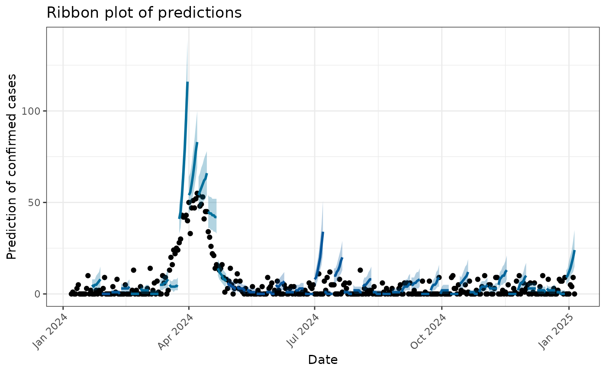
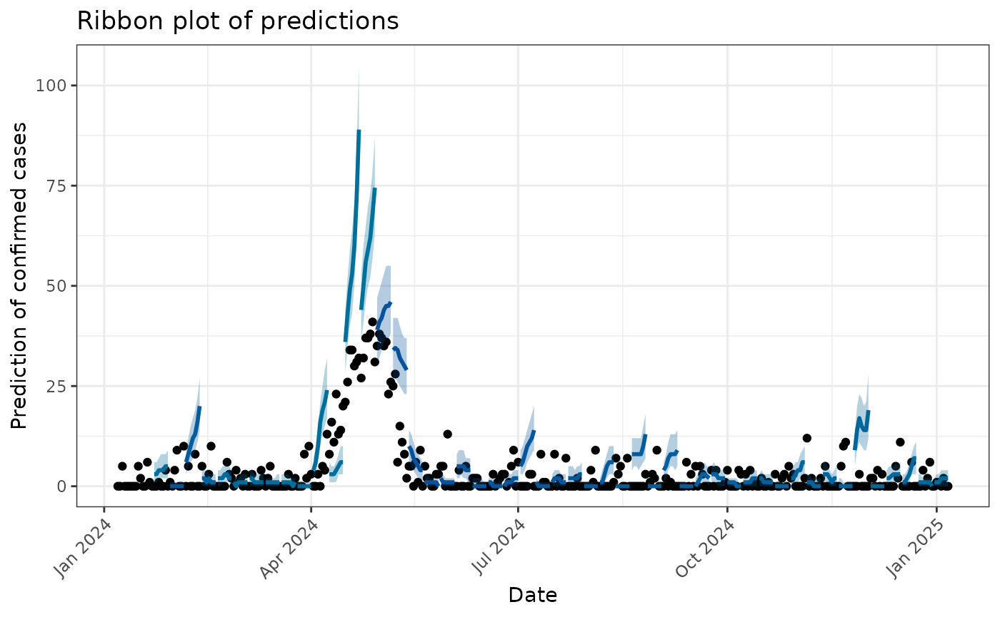
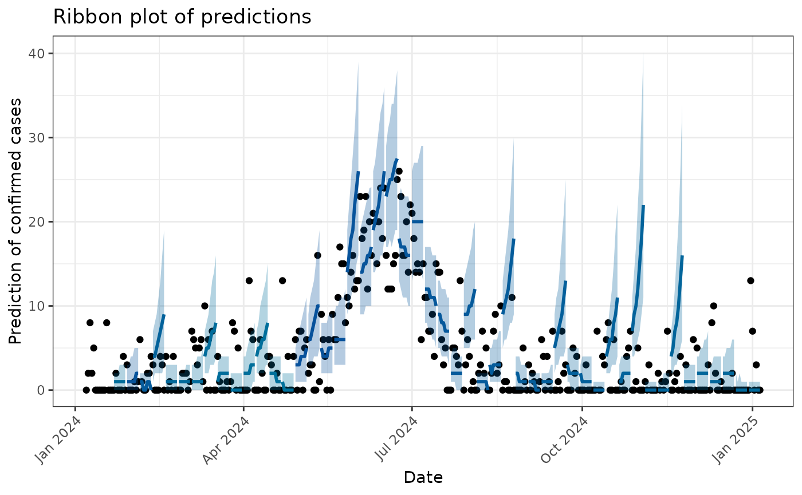

# Model fitting and producing short-term forecasts using daily data with EpiEstim

``` r
library(dplyr)
#> 
#> Attaching package: 'dplyr'
#> The following objects are masked from 'package:stats':
#> 
#>     filter, lag
#> The following objects are masked from 'package:base':
#> 
#>     intersect, setdiff, setequal, union
library(ViroReportR)
library(ggplot2)
library(purrr)
library(tidyr)
```

## Overview

This vignette provides a short demonstration of the model fitting
functions in `ViroReportR` which extend the functionality and wrap the
`estimate_R` function from the `EpiEstim` package to produce short-term
forecasts.

## Loading data

For this short demonstration, we will simulate daily data for Influenza
A, RSV and Covid-19, using the function `simulate_data` which is
provided with the `ViroReportR` package. The input dataset must have two
columns: `date` and `confirm` in accordance to format accepted by the
model fitting functions.

``` r
data <- simulate_data(days=365, #days spanning simulation
                      peaks = c("flu_a"=90,"rsv"=110,"sars_cov2"=160), #peak day for each disease
                      amplitudes=c("flu_a"=50,"rsv"=40,"sars_cov2"=20), #amplitude of peak for each disease
                      scales = c("flu_a"=-0.004,"rsv"=-0.005,"sars_cov2"=-0.001), # spread of peak for each disease
                      time_offset = 0, #number of days to offset start of simulation
                      noise_sd = 5, #noise term
                      start_date = "2024-01-07" #starting day (Sunday)
                      )
```

``` r
data$date <- lubridate::ymd(data$date)

vri_data <- data %>% 
            pivot_longer(cols = -date,  # all columns except 'date'
                          names_to = "disease_type",
                          values_to = "confirm") # <-- need ot be called confirm

# VRI data set-up
vri_name_list <- vri_data %>% 
    dplyr::group_by(disease_type) %>% 
  dplyr::group_keys() %>% dplyr::pull()


vri_data_list <- vri_data %>% 
  dplyr::group_by(disease_type) %>% 
  dplyr::group_map(~.x)

names(vri_data_list) <- vri_name_list
```

## Model fitting and forecasting

The code below estimates the reproduction number using `EpiEstim`
through the
[`generate_forecast()`](https://bccdc-phsa.github.io/ViroReportR/reference/generate_forecast.md)
function for each disease type via the
[`purrr::map2()`](https://purrr.tidyverse.org/reference/map2.html)
function. The
[`generate_forecast()`](https://bccdc-phsa.github.io/ViroReportR/reference/generate_forecast.md)
function prepares the data, estimates the reproduction number, and
produces short-term forecasts of daily confirmed cases for an `n_days`
forecast horizon.

``` r
#parameters set-up
start_date <- min(vri_data$date) + 13
forecast_horizon <- 7
smooth <- FALSE
validate_window_size <- 7

forecasts_results <- tibble(
  vri_data_list,
  forecasts = map2(
    vri_data_list,
    vri_name_list,
    ~ generate_forecast(
      data = .x,
      smooth_data = smooth,
      type = .y,
      n_days = forecast_horizon,
      start_date = start_date
    )
  )
)

names(forecasts_results$forecasts) <- vri_name_list
names(forecasts_results$vri_data_list) <- vri_name_list
```

The function supports forecasting for SARS-CoV2, RSV and Influenza A
primarily but also provides functionality to forecast other respiratory
diseases. Any other respiratory disease can be specified by setting
`type = other`. If `type = other` is set, a user-specified `mean_si` and
`std_si` must be passed to the function as well.

## Validation

The package provides validation functionality to support predictive
performance evaluation. The forecasting model is trained on historical
data and used to predict daily cases r `forecast_horizon` days ahead.
Validation compares the model’s forecasted values with observed
historical data, where overlap between prediction intervals and actual
cases indicates good model performance. A rolling window approach is
applied to the historical data to generate multiple validation datasets.

#### flu_a



#### rsv



#### sars_cov2



## Forecast Report

Finally, the `ViroReportR` package can conveniently generate an
automated report for the current season for all supported viral
respiratory diseases (Influenza-A, RSV and SARS-CoV2) using the
`generate_forecast_report` function, which renders an HTML report.

``` r
tmp_dir <- tempdir()

# Save the simulated data
data_path <- file.path(tmp_dir, "simulated_data.csv")
write.csv(vri_data, data_path, row.names = FALSE)

output_path <- tempdir()
generate_forecast_report(input_dir = data_path,
                            output_dir = output_path,
                            n_days = 7,
                            validate_window_size = 7,
                            smooth = TRUE)

cat("Report saved to:", output_path, "\n")

if (interactive() && file.exists(output_path)) {
  utils::browseURL(output_path)
}
```
