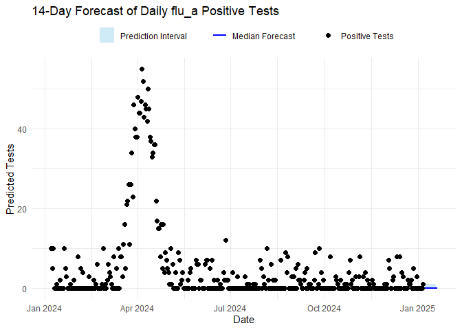
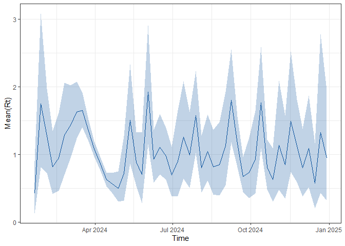
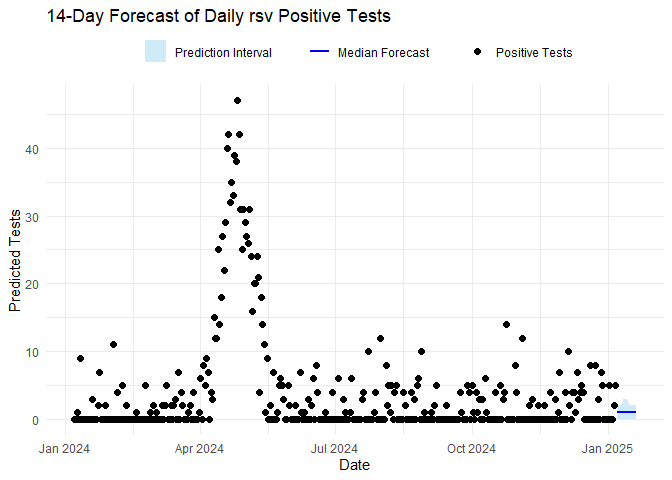
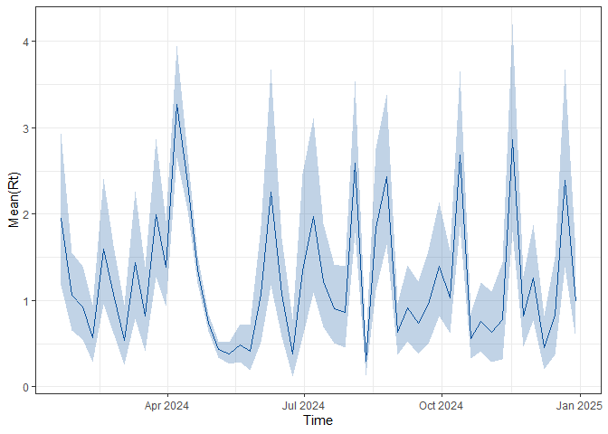
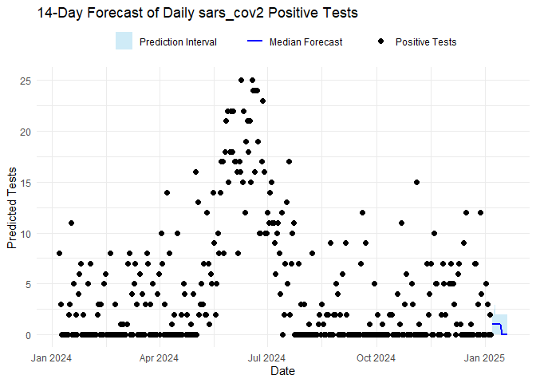
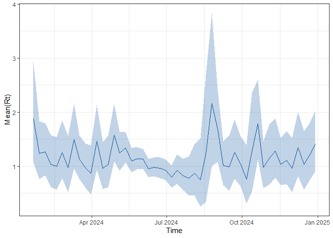

# ViroReportR 

The goal of `ViroReportR` is to provide a toolbox to conveniently
generate short-term forecasts (with accompanied diagnostics) for viral
respiratory diseases.

## Installation

### CRAN (recommended)

Install the released version from CRAN:

``` r
install.packages("ViroReportR")

You can then install the development version of `ViroReportR` from [GitHub](https://github.com/) with:

``` r

devtools::install_github("BCCDC-PHSA/ViroReportR")
```

## Quick Start

`ViroReportR` can be used to generate short-term forecasts with
accompanied diagnostics in a few lines of code. We go through an example
here where the `EpiEstim` backend is used to generate forecasts of
Influenza-A, RSV and SARS-CoV-2.

``` r
library(ViroReportR)
library(tidyverse)
#> ── Attaching core tidyverse packages ──────────────────────── tidyverse 2.0.0 ──
#> ✔ dplyr     1.1.4     ✔ readr     2.1.5
#> ✔ forcats   1.0.0     ✔ stringr   1.6.0
#> ✔ ggplot2   4.0.0     ✔ tibble    3.2.1
#> ✔ lubridate 1.9.4     ✔ tidyr     1.3.1
#> ✔ purrr     1.0.2     
#> ── Conflicts ────────────────────────────────────────── tidyverse_conflicts() ──
#> ✖ dplyr::filter() masks stats::filter()
#> ✖ dplyr::lag()    masks stats::lag()
#> ℹ Use the conflicted package (<http://conflicted.r-lib.org/>) to force all conflicts to become errors
library(ggplot2)
library(here)
#> here() starts at C:/Users/rebeca.falcao/ViroReportR
library(DT)
library(purrr)
library(kableExtra)
#> 
#> Attaching package: 'kableExtra'
#> 
#> The following object is masked from 'package:dplyr':
#> 
#>     group_rows
```

We will use `simulate_data` to simulate date for Influenza A, RSV, and
SARS-CoV-2, which is included with the `ViroReportR` package. We then
pivot the simulated data to transform into a dataset with three columns:
`date`, `disease_type` and `confirm` in accordance to format accepted by
the model fitting functions.

``` r
diseases<-c("flu_a", "rsv", "sars_cov2")
data <- simulate_data(days=365, #days spanning simulation
                      peaks = c("flu_a"=90,"rsv"=110,"sars_cov2"=160), #peak day for each disease
                      amplitudes=c("flu_a"=50,"rsv"=40,"sars_cov2"=20), #amplitude of peak for each disease
                      scales = c("flu_a"=-0.004,"rsv"=-0.005,"sars_cov2"=-0.001), # spread of peak for each disease
                      time_offset = 0, #number of days to offset start of simulation
                      noise_sd = 5, #noise term
                      start_date = "2024-01-07" #starting day (Sunday)
                      )

data$date <- lubridate::ymd(data$date)

vri_data_list <- map2(rep(list(data), length(diseases)),
  diseases,~ get_aggregated_data(.x, "date", .y)) %>% set_names(diseases)

head(vri_data_list)
#> $flu_a
#> # A tibble: 366 × 2
#>    date       confirm
#>    <date>       <dbl>
#>  1 2024-01-07       0
#>  2 2024-01-08       6
#>  3 2024-01-09       0
#>  4 2024-01-10       0
#>  5 2024-01-11       0
#>  6 2024-01-12       0
#>  7 2024-01-13       4
#>  8 2024-01-14       0
#>  9 2024-01-15       2
#> 10 2024-01-16       0
#> # ℹ 356 more rows
#> 
#> $rsv
#> # A tibble: 366 × 2
#>    date       confirm
#>    <date>       <dbl>
#>  1 2024-01-07       0
#>  2 2024-01-08       0
#>  3 2024-01-09       1
#>  4 2024-01-10       0
#>  5 2024-01-11       9
#>  6 2024-01-12       0
#>  7 2024-01-13       0
#>  8 2024-01-14       0
#>  9 2024-01-15       0
#> 10 2024-01-16       0
#> # ℹ 356 more rows
#> 
#> $sars_cov2
#> # A tibble: 366 × 2
#>    date       confirm
#>    <date>       <dbl>
#>  1 2024-01-07       8
#>  2 2024-01-08       3
#>  3 2024-01-09       0
#>  4 2024-01-10       0
#>  5 2024-01-11       0
#>  6 2024-01-12       0
#>  7 2024-01-13       0
#>  8 2024-01-14       0
#>  9 2024-01-15       2
#> 10 2024-01-16       3
#> # ℹ 356 more rows
```

## Model fitting and forecasting

The code below estimates the reproduction number using `EpiEstim`
through the
[`generate_forecast()`](https://bccdc-phsa.github.io/ViroReportR/reference/generate_forecast.md)
function for each disease type via the
[`purrr::map2()`](https://purrr.tidyverse.org/reference/map2.html)
function. The
[`generate_forecast()`](https://bccdc-phsa.github.io/ViroReportR/reference/generate_forecast.md)
function prepares the data, estimates the reproduction number, and
produces short-term forecasts of daily confirmed cases for an `n_days`
forecast horizon. The other current choice for the forecasting algorithm
is `EpiFilter` (WIP).

``` r
# parameters set-up 
start_date <- min(data$date) + 13
n_days <- 14 # number of days ahead to forecast (n_days)
smooth <- FALSE # logical indicating whether smoothing should be applied in the forecast
```

``` r
forecasts_results <- tibble(
  vri_data_list,
  forecasts = map2(
    vri_data_list,
    diseases,
    ~ generate_forecast(
      data = .x,
      smooth_data = smooth,
      type = .y,
      n_days = n_days,
      start_date = start_date
    )
  )
)


names(forecasts_results$forecasts) <- diseases
names(forecasts_results$vri_data_list) <- diseases
```

## Plotting results

The code below plots the forecasts results and the estimated $R_{t}$ for
each disease. To plot $R_{t}$, the code below uses `plot_rt` function
included in the package.

``` r


for (vri in diseases) {
  forecast_plot <- ggplot() +
  geom_ribbon(
    data = forecasts_results$forecasts[[vri]][["forecast_res_quantiles"]],
    aes(x = date, ymin = p10, ymax = p90, fill = "Prediction Interval"),
    alpha = 0.4
  ) +
  geom_line(
    data = forecasts_results$forecasts[[vri]][["forecast_res_quantiles"]],
    aes(x = date, y = p50, color = "Median Forecast"),
    linewidth = 1
  ) +
  geom_point(
    data = forecasts_results$vri_data_list[[vri]],
    aes(x = date, y = confirm, shape = "Positive Tests"),
    size = 2,
    color = "black"
  )  +
  
  labs(
    title = paste0(n_days, "-Day Forecast of Daily ", vri, " Positive Tests"),
    x = "Date", y = "Predicted Tests",
    fill = "", color = "", shape = ""
  ) +
  scale_fill_manual(values = c("Prediction Interval" = "skyblue")) +
  scale_color_manual(values = c("Median Forecast" = "blue")) +
  scale_shape_manual(values = c("Positive Tests" = 16)) +
  theme_minimal() +
  theme(legend.position = "top", legend.direction = "horizontal")
  
  # create Rt plot
  rt_plot <- ViroReportR:::plot_rt(forecasts_results$forecasts[[vri]])
  print(forecast_plot)
  print(rt_plot)
}
```



## Forecast report

Finally, the `ViroReportR` package can generate an automated report for
the current season across all supported respiratory viruses (Influenza
A, RSV, and SARS-CoV-2) using the
[`generate_forecast_report()`](https://bccdc-phsa.github.io/ViroReportR/reference/generate_forecast_report.md)
function. This function renders an HTML report summarizing model outputs
and forecasts.

To use it, provide an input file (`input_file`) containing the required
data with three columns—date, disease_type, and confirm—and specify an
output directory (`output_directory)` where the report will be saved.

``` r
# rendering forecast report
df <- imap_dfr(vri_data_list, ~ .x %>% mutate(disease_type = .y))
input_file<-"simulated_data.csv"
write.csv(df, input_file, row.names = FALSE)
generate_forecast_report(
  input_data_dir =  input_file, # input filepath
  output_dir = output_directory, # output directory
  n_days = 14, # number of days to forecast
  validate_window_size = 7, # number of days between each validation window
  smooth = FALSE, # logical indicating whether smoothing should be applied in the forecast
)
```
